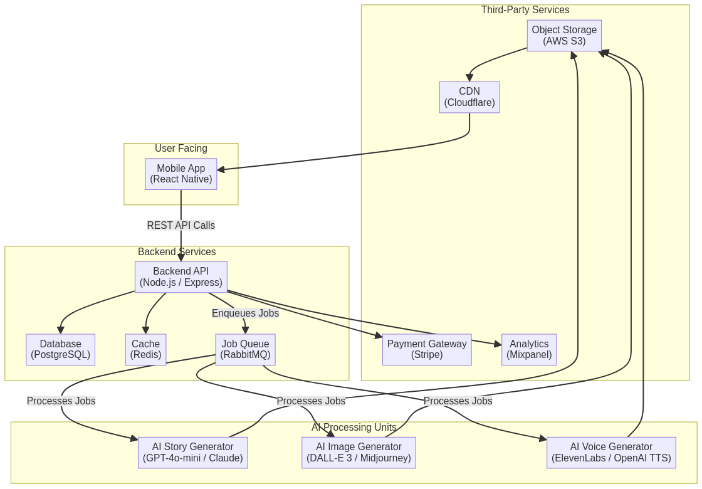

# StoryCanvas: Technology Stack & System Architecture

## 1. Guiding Principles for Technology Selection

The technology stack for StoryCanvas is chosen based on the following core principles:

- **Scalability & Performance**: The architecture must handle a rapidly growing user base and the intensive computational demands of AI content generation without compromising on user experience.
- **Developer Velocity**: We will prioritize technologies with strong ecosystems, excellent documentation, and large talent pools to enable rapid development and iteration.
- **Cost-Effectiveness**: The stack must be optimized for cost, particularly in managing the operational expenses of third-party AI services and cloud infrastructure.
- **Cross-Platform Compatibility**: To reach the widest possible audience from day one, the mobile application will be built on a cross-platform framework.
- **Reliability & Maintainability**: We will use proven, stable technologies and managed services wherever possible to reduce operational overhead and ensure high availability.

## 2. High-Level System Architecture

The system is designed as a cloud-native, microservices-oriented architecture. The core components include a cross-platform mobile application, a scalable backend API, an asynchronous job queue for AI processing, and integrations with best-in-class third-party AI services. Media assets are stored in a dedicated object storage service and delivered globally via a Content Delivery Network (CDN) to ensure low-latency access for users worldwide.

Below is a diagram illustrating the overall system architecture:

## 3. Detailed Technology Stack Breakdown

### Frontend (Mobile Application)

| Category      | Technology        | Rationale                                                                                                                              |
|---------------|-------------------|----------------------------------------------------------------------------------------------------------------------------------------|
| **Framework**   | **React Native**    | Enables cross-platform development for iOS and Android from a single codebase, significantly reducing development time and cost. It has a mature ecosystem and a large community. |
| **State Mgmt**  | **Redux Toolkit**   | Provides a predictable and centralized state container, essential for managing complex application state, such as user authentication, story data, and UI settings. |
| **Data Fetching** | **RTK Query**       | A powerful data fetching and caching tool built into Redux Toolkit. It simplifies server state management, caching, and optimistic updates. |
| **UI Library**  | **React Native Paper** & **Custom Components** | A combination of a pre-built component library for standard elements (buttons, modals) and custom-built components for a unique, branded look and feel. |
| **Navigation**  | **React Navigation**| The de-facto standard for routing and navigation in React Native apps, offering a flexible and native-like navigation experience. |

### Backend Services

| Category      | Technology        | Rationale                                                                                                                              |
|---------------|-------------------|----------------------------------------------------------------------------------------------------------------------------------------|
| **Language**    | **Node.js**         | Its non-blocking, event-driven architecture is ideal for I/O-heavy applications like ours, which involve many API calls to external services. JavaScript across the stack simplifies development. |
| **Framework**   | **Express.js**      | A minimal and flexible Node.js framework that provides a robust set of features for web and mobile applications without being overly opinionated. |
| **Database**    | **PostgreSQL**      | A powerful, open-source object-relational database system with a strong reputation for reliability, feature robustness, and performance. It can handle complex queries and data types. |
| **ORM**         | **Prisma**          | A next-generation ORM that provides a type-safe database client, making database interactions easier, safer, and more efficient. |
| **Job Queue**   | **RabbitMQ**        | A robust and mature message broker that allows for decoupling the API from the time-consuming AI generation tasks, ensuring the UI remains responsive. |
| **Cache**       | **Redis**           | An in-memory data store used for caching frequently accessed data (e.g., user sessions, story metadata), reducing database load and improving API response times. |

### AI & Machine Learning Services

| Category              | Service(s)                               | Rationale                                                                                                                              |
|-----------------------|------------------------------------------|----------------------------------------------------------------------------------------------------------------------------------------|
| **Text Generation**     | **OpenAI GPT-4o-mini** or **Claude 3.5 Sonnet** | A/B testing will determine the best model based on a balance of story quality, coherence, speed, and cost. Both are leading models in creative text generation. |
| **Image Generation**    | **DALL-E 3** or **Midjourney API**         | DALL-E 3 offers strong prompt adherence and API access. Midjourney is renowned for its artistic quality. The choice will depend on API availability and visual consistency. |
| **Voice Generation**    | **ElevenLabs** or **OpenAI TTS**         | ElevenLabs provides highly realistic and emotive voices with fine-grained control. OpenAI's TTS is a strong, cost-effective alternative. |

### Infrastructure & DevOps

| Category              | Service(s)                               | Rationale                                                                                                                              |
|-----------------------|------------------------------------------|----------------------------------------------------------------------------------------------------------------------------------------|
| **Cloud Provider**      | **Amazon Web Services (AWS)**            | Offers a comprehensive suite of managed services (S3, RDS, EKS) that are reliable, scalable, and well-documented, reducing operational burden. |
| **Containerization**    | **Docker**                               | Standardizes the development and deployment environment, ensuring consistency from local development to production. |
| **Orchestration**       | **Amazon EKS (Kubernetes)**              | Provides a powerful and scalable platform for managing containerized applications, enabling automated deployments, scaling, and management. |
| **CI/CD**               | **GitHub Actions**                       | Integrates seamlessly with our GitHub repository to automate testing, building, and deploying the application, ensuring a fast and reliable release cycle. |
| **Object Storage**      | **Amazon S3**                            | A highly durable and scalable object storage service for storing all generated media (images, audio files, PDFs). |
| **CDN**                 | **Cloudflare**                           | Provides global content delivery, security (WAF, DDoS protection), and performance optimization, ensuring fast load times for users everywhere. |

### Third-Party Services

| Category              | Service(s)                               | Rationale                                                                                                                              |
|-----------------------|------------------------------------------|----------------------------------------------------------------------------------------------------------------------------------------|
| **Payments**            | **Stripe**                               | The industry leader for payment processing, offering a developer-friendly API, robust security, and seamless handling of subscriptions and one-time payments. |
| **Analytics**           | **Mixpanel** or **Amplitude**            | Powerful product analytics platforms that allow for deep insights into user behavior, feature adoption, and conversion funnels, crucial for data-driven product decisions. |
| **Error Monitoring**    | **Sentry**                               | Provides real-time error tracking and performance monitoring, enabling us to proactively identify and fix issues before they impact a large number of users. |

## 4. Data Management & Persistence

- **User Data**: All user-related information, including authentication details (hashed passwords), profiles, and subscription status, will be stored in the **PostgreSQL** database.
- **Story Metadata**: Information about each story—such as the title, character descriptions, genre, and pointers to the media assets—will also be stored in **PostgreSQL**.
- **Media Assets**: The actual generated content (images, audio files, video files, PDFs) will be stored in **Amazon S3**. This is more cost-effective and scalable for large binary files.
- **Caching**: **Redis** will be used to cache session data and frequently requested database queries to improve performance.

## 5. Rationale for Key Decisions

- **React Native over Native (Swift/Kotlin)**: While native development offers the best performance, the speed-to-market advantage of a single cross-platform codebase is a significant strategic benefit for an MVP. React Native's maturity makes it a safe and powerful choice.
- **Node.js over Python for Backend**: While Python is strong in AI, Node.js's performance in I/O-bound operations and the ability to use JavaScript across the full stack (frontend and backend) simplifies the development process and reduces context-switching for developers.
- **Microservices over Monolith**: A microservices approach, with a separate job queue for AI tasks, prevents the main API from becoming blocked by long-running generation processes. This is critical for maintaining a responsive user experience.
- **Managed Services over Self-Hosting**: Using managed services like Amazon RDS for PostgreSQL and EKS for Kubernetes significantly reduces the operational complexity and allows the development team to focus on building product features rather than managing infrastructure.

